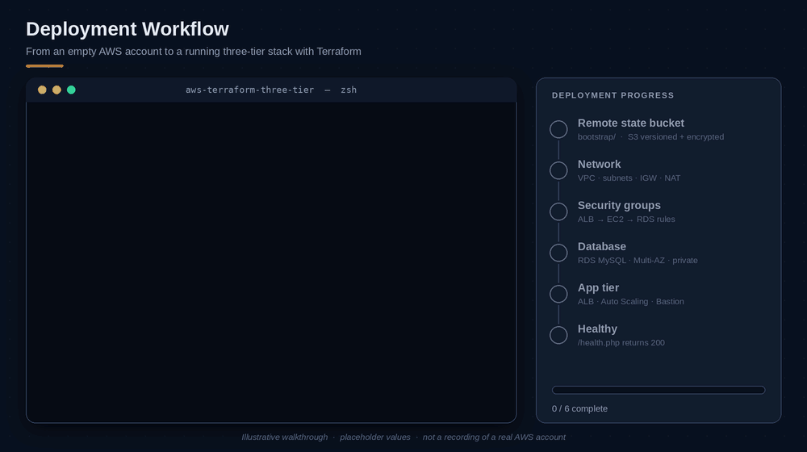
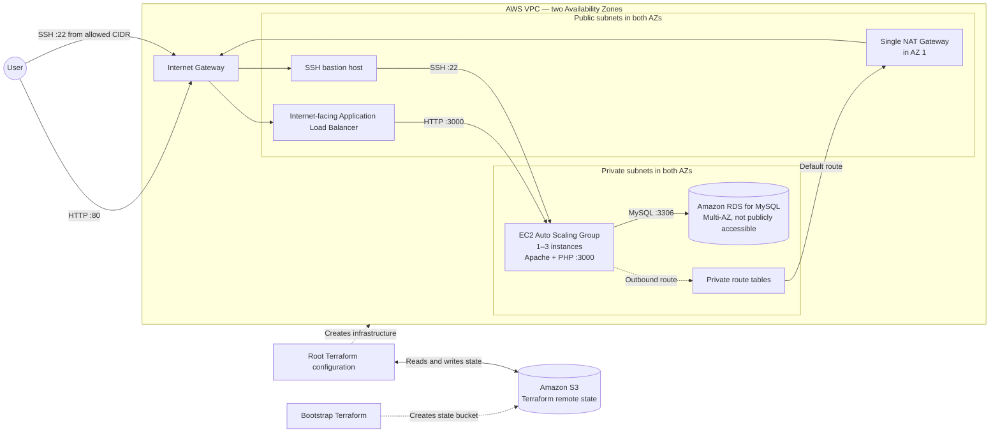
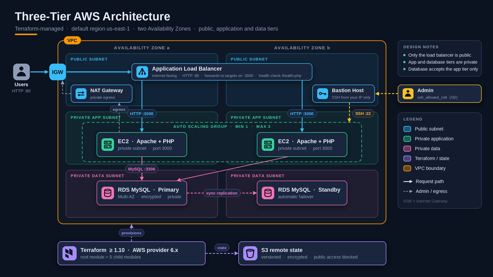
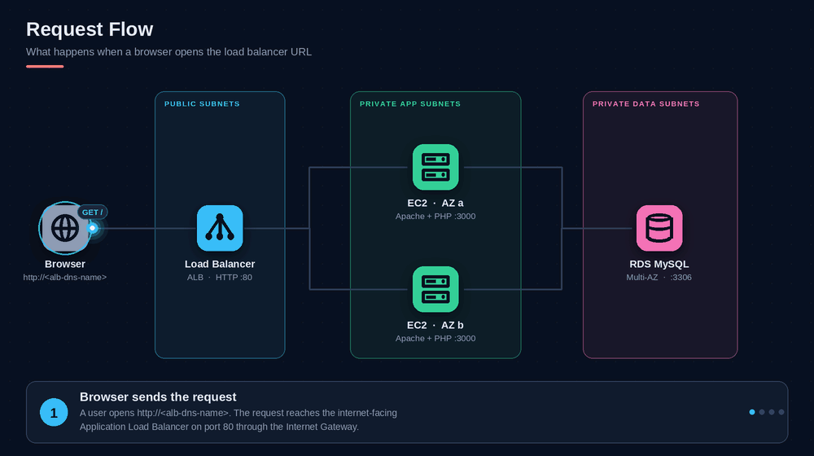
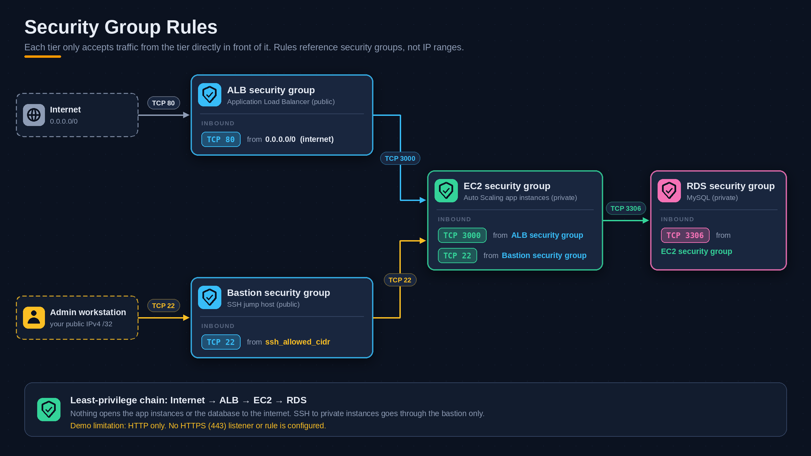
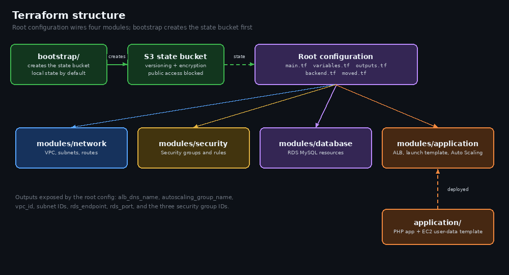
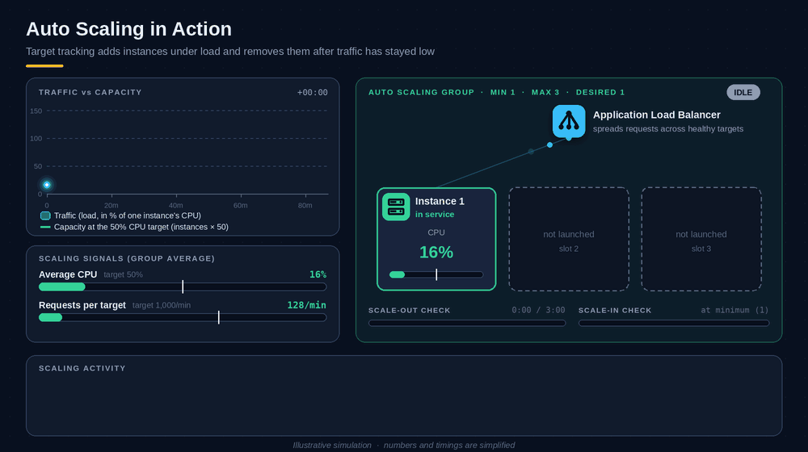
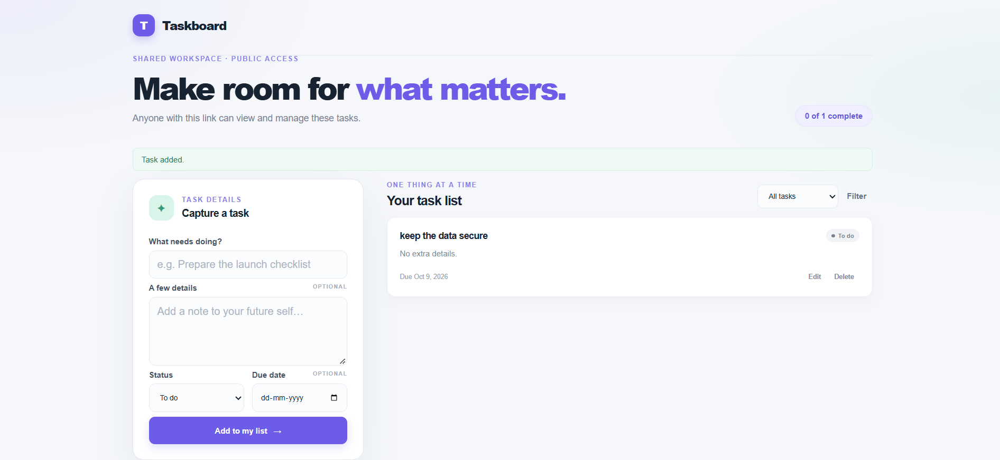

# Production-Style AWS Infrastructure


Terraform-managed AWS infrastructure for a small PHP task manager. The project demonstrates a modular, multi-tier deployment with public and private subnets, an Application Load Balancer, a bastion host for SSH access, an EC2 Auto Scaling group, and a private MySQL database.

> [!WARNING]
> This is a learning/demo project, not a production-ready service. The task manager is publicly accessible over unencrypted HTTP and has no user authentication: anyone with its URL can view, create, update, or delete tasks. Do not store real or sensitive data. Terraform state and EC2 user data contain credentials and must be protected.

## Demo




*Illustrative walkthrough of the deployment workflow described below. It uses placeholder values and is not a recording of a real AWS account.*

## Table of contents

- [Features](#features)
- [Architecture](#architecture)
- [How a request flows](#how-a-request-flows)
- [Security groups](#security-groups)
- [Terraform structure](#terraform-structure)
- [Tech stack](#tech-stack)
- [Repository layout](#repository-layout)
- [Requirements](#requirements)
- [Deploy](#deploy)
- [Load testing and Auto Scaling](#load-testing-and-auto-scaling)
- [Cost estimate](#cost-estimate)
- [Configuration reference](#configuration-reference)
- [Outputs](#outputs)
- [Run the application locally](#run-the-application-locally)
- [Operational notes](#operational-notes)
- [Troubleshooting](#troubleshooting)
- [License](#license)

## Features

**Infrastructure**

- **Network:** VPC, two public subnets, two private subnets, internet gateway, and routing through a NAT gateway across two Availability Zones.
- **Bastion:** minimal public Ubuntu EC2 host for SSH access; ingress is restricted to the configured `ssh_allowed_cidr`.
- **Application tier:** internet-facing Application Load Balancer and an EC2 Auto Scaling group running Apache and PHP in private subnets. Target tracking uses CPU, ALB requests per target, and network in/out; the group starts with one instance and scales between one and three.
- **Database:** encrypted, private, multi-AZ Amazon RDS for MySQL.
- **Security groups:** application instances accept web traffic from the load balancer and SSH only from the bastion; MySQL accepts traffic from the application tier.
- **State bucket:** separate bootstrap configuration with S3 versioning, server-side encryption, and public access blocked.

**Sample application**

- Create, list, update, filter, and delete tasks with a title, description, status, and optional due date.
- Prepared SQL statements and short-lived signed CSRF tokens; no PHP/MySQL session dependency.
- Responsive HTML and CSS frontend.
- ALB health check at `/health.php` that verifies the PHP runtime and the RDS connection.
- Footer shows the hostname and private IP of the EC2 instance that served the page.

## Architecture






Terraform creates the network, security rules, application tier, and database as separate modules. The `bootstrap/` configuration creates the S3 bucket used by the root configuration for remote state. A single NAT Gateway in AZ 1 provides outbound internet access for both private application subnets.

## How a request flows



## Security groups



## Terraform structure



## Auto Scaling Workflows



## Application 



## Tech stack

| Layer | Technology |
| --- | --- |
| Infrastructure as code | Terraform 1.10+ (AWS provider 6.x) |
| Remote state | Amazon S3 |
| Networking | Amazon VPC, NAT gateway, internet gateway |
| Load balancing | Application Load Balancer |
| Compute | EC2 Auto Scaling group (launch template with user data) |
| Web server / runtime | Apache, PHP 8.1+ (PDO MySQL, `mbstring`) |
| Database | Amazon RDS for MySQL |

## Repository layout

```text
.
├── application/
│   ├── deploy/                  # EC2 user-data template
│   └── public/                  # PHP app, health checks, and CSS
├── bootstrap/                   # Creates the Terraform state bucket
├── docs/
│   └── assets/
│       ├── architecture.png     # AWS infrastructure architecture
│       ├── demo.gif             # Deployment workflow animation
│       ├── request-flow.gif     # Request flow animation
│       ├── security-groups.png  # Security group traffic rules
│       ├── social-preview.png   # Repository social preview
│       └── terraform-structure.png  # Terraform module structure
├── modules/
│   ├── application/             # Load balancer, launch template, Auto Scaling
│   ├── bastion/                  # SSH bastion EC2 instance
│   ├── database/                # RDS MySQL resources
│   ├── network/                 # VPC, subnets, and routes
│   └── security/                # Security groups and rules
├── backend.tf                   # Root S3 backend configuration
├── main.tf                      # Provider and module wiring
├── moved.tf                     # Terraform state address migrations
├── outputs.tf                   # Deployment outputs
└── variables.tf                 # Root input variables
```

See [application/README.md](application/README.md) for details about the PHP application.

## Requirements

- Terraform **1.10 or newer**
- An AWS account and credentials configured for the AWS provider
- Permissions to create the VPC, EC2, ELB, RDS, and S3 resources used by the configuration
- An S3 bucket name that is globally unique, for Terraform state

The AWS provider is constrained to the `6.x` release series. The default deployment region is `us-east-1`, and the default availability zones are `us-east-1a` and `us-east-1b`; change them if needed for your account and region.

## Deploy

### 1. Configure the remote state bucket

The checked-in `backend.tf` contains a bucket name from the original environment. Before using this project, choose a globally unique bucket name you control. Set the same name in `bootstrap/variables.tf` (or pass it as a variable) and in the `bucket` setting in the root `backend.tf`.

Create the bucket first:

```sh
cd bootstrap
terraform init
terraform apply -var="bucket_name=your-globally-unique-state-bucket"
cd ..
```

The bootstrap configuration uses local state by default. Keep that local bootstrap state private and backed up. The root configuration stores its state in the S3 bucket.

### 2. Configure credentials and application secrets

Create a private `terraform.tfvars` file in the project root:

```hcl
aws_region          = "us-east-1"
availability_zones  = ["us-east-1a", "us-east-1b"]
db_password         = "replace-with-a-unique-database-password"
app_admin_username  = "admin"
app_admin_password  = "replace-with-a-unique-password-at-least-12-characters"
app_session_secret  = "replace-with-a-random-secret-at-least-32-characters"
ssh_allowed_cidr    = "203.0.113.10/32"
```

Set `ssh_allowed_cidr` to your public IPv4 address with `/32`. Keep `linux_practice.pem` in the project root; Terraform uses its public half in `linux_practice.pem.pub` to register an EC2 key pair, and attaches that key pair to the bastion and app instances. Generate the public file if needed with `ssh-keygen -y -f linux_practice.pem > linux_practice.pem.pub`. The private `.pem` file is ignored by Git and is never uploaded to AWS.

Generate a session secret with:

```sh
openssl rand -hex 32
```

Use unique values and never commit `terraform.tfvars`, credentials, state files, or plan files. You can also inject the sensitive values through `TF_VAR_` environment variables instead of a file.

> [!IMPORTANT]
> Sensitive Terraform variables are still stored in Terraform state and in EC2 launch-template user data. Treat both as secrets.

### 3. Initialize and deploy

From the project root:

```sh
terraform init
terraform validate
terraform plan
terraform apply
```

If you change the S3 backend configuration after a previous initialization, review Terraform's state migration prompt carefully. Use `terraform init -reconfigure` only when you intend to connect to the newly configured backend without migrating existing state.

On first launch, EC2 user data installs Apache and PHP with PDO MySQL support, deploys the application files, configures Apache to listen on port 3000, and enables the service. The application creates its tables and the shared internal database owner on first launch.

### 4. Open the application

```sh
terraform output -raw alb_dns_name
```

Open the output using `http://`, for example `http://<alb-dns-name>`. Wait for the Auto Scaling group instances to become healthy behind the load balancer.

The Auto Scaling group replaces instances when the launch template changes; wait for the new instances to pass the ALB health check before removing old instances.

### 5. SSH to a private application instance

Retrieve the bastion address:

```sh
terraform output -raw bastion_public_ip
```

Use the private IPv4 address of an application instance from the EC2 console, then connect through the bastion:

```sh
ssh -i linux_practice.pem -J ubuntu@<bastion-public-ip> ubuntu@<application-private-ip>
```

The SSH key file must be available locally and readable only by its owner (for example, `chmod 400 linux_practice.pem` on Linux/macOS).

## Load testing and Auto Scaling

The ASG has a minimum capacity of one and maximum of three. It has four target-tracking policies:

| Signal | Target |
| --- | ---: |
| Average CPU utilization | 50% |
| ALB requests per healthy target | 1,000 requests/minute |
| Average network input | 50,000,000 bytes per instance |
| Average network output | 50,000,000 bytes per instance |

All four policies have scale-in enabled. AWS scales out when any policy determines capacity should increase, but scales in only when all enabled target-tracking policies permit it and the group is above its minimum. When load falls below all four targets, AWS gradually removes excess instances; it never scales below one. Scale-in is not immediate when a benchmark ends: stop the test, allow the AWS metrics to settle (the network metrics are sampled less frequently), then check the ASG **Activity** tab. Instance warmup is 300 seconds; target tracking also scales in conservatively to avoid removing capacity too quickly.

No memory or disk scaling metric is installed. Those require per-instance metric collection, which this configuration intentionally omits.

To create CPU load on an app instance, SSH to it through the bastion, then run:

```sh
sudo apt-get update
sudo apt-get install -y stress-ng
stress-ng --cpu 2 --timeout 15m --metrics-brief
```

For an ALB traffic test, use a moderate concurrency first and `-l` to allow the response length to vary across app instances (the HTML footer includes the serving instance details):

```sh
ALB_DNS=$(terraform output -raw alb_dns_name)
ab -n 5000 -c 25 -l -s 30 "http://${ALB_DNS}/"
```

The previous `ab -n 50000 -c 100` run took over 10 minutes, reported 25,791 response-length mismatches, and returned 18,152 non-2xx responses. ApacheBench can report dynamic-page length differences when different app instances return different hostname/IP footers; `-l` tells it to accept variable response lengths. Non-2xx responses are real HTTP errors and are not fixed by `-l`. Check the app server logs and status codes if they recur:

```sh
for i in $(seq 1 100); do
  curl -s -o /dev/null -w '%{http_code}\n' "http://${ALB_DNS}/"
done | sort | uniq -c
```

On an app server, inspect application errors with:

```sh
sudo tail -n 100 /var/log/apache2/task-manager-error.log
```

After `terraform apply`, open the ASG in the same AWS region and check **Automatic scaling** for the four target-tracking policies and **Activity** for scale-out/scale-in decisions. If the group does not scale in, inspect each policy's metric and verify all signals are below target; one busy metric can prevent scale-in. These policies use AWS's built-in CPU, network, and ALB request metrics; no server monitoring agent or custom memory/disk metrics are configured. See [AWS target tracking behavior](https://docs.aws.amazon.com/autoscaling/ec2/userguide/as-scaling-target-tracking.html) for how multiple policies combine.

## Cost estimate

Approximate **us-east-1 On-Demand** costs for 730 hours/month, before tax and usage-dependent charges:

| Resource | Assumption | Approx. monthly cost |
| --- | --- | ---: |
| NAT Gateway | One gateway, always on; excludes processed data | $33 |
| Application Load Balancer | One ALB, base hourly charge; excludes LCU usage | $16.50 |
| EC2 | One `t3.micro` bastion plus 1–3 `t3.micro` app instances | $15–$31 |
| RDS for MySQL | One `db.t3.micro` Multi-AZ DB instance | $25–$40 |
| Storage | 20 GB RDS storage and small EC2 root volumes | $4–$8 |
| Public IPv4 addresses | Bastion, NAT gateway, and ALB addresses; approximate | $11–$20 |
| **Estimated baseline** | One app instance; before traffic-related charges | **about $105–$135/month** |
| **With three app instances** | Same assumptions, two additional app instances | **about $120–$150/month** |

These are planning estimates, not a quote. AWS rates vary by region, date, instance availability, and account discounts. NAT data processing (about $0.045/GB in this region), ALB LCU-hours, internet egress, extra storage/IOPS, snapshots, and taxes are additional and depend on usage. A sustained load test can also keep the ASG at higher capacity and increase the bill. The NAT Gateway, ALB, database, and minimum app capacity continue to cost money even when request traffic is low; scale-in only removes app instances above the minimum.

For a live estimate with your account and exact settings, use the [AWS Pricing Calculator](https://calculator.aws/) and review the official [NAT Gateway pricing](https://aws.amazon.com/vpc/pricing/), [ALB pricing](https://aws.amazon.com/elasticloadbalancing/pricing/), [EC2 pricing](https://aws.amazon.com/ec2/pricing/on-demand/), and [RDS for MySQL pricing](https://aws.amazon.com/rds/mysql/pricing/) pages. To stop most charges, destroy the stack when it is not needed; this deletes infrastructure and the current RDS configuration skips its final snapshot, so back up data first.

## Configuration reference

| Variable | Required | Description |
| --- | --- | --- |
| `aws_region` | No | AWS deployment region; defaults to `us-east-1`. |
| `availability_zones` | No | Two AZs for the network; defaults to `us-east-1a` and `us-east-1b`. |
| `ssh_allowed_cidr` | No | IPv4 CIDR allowed to SSH to the bastion; defaults to `39.45.123.67/32`. |
| `db_password` | Yes | Master password for the MySQL database. |
| `app_admin_username` | No | Internal seed account name; defaults to `admin`. |
| `app_admin_password` | Yes | Internal seed account password; at least 12 characters. |
| `app_session_secret` | Yes | Application signing secret used to validate short-lived CSRF tokens; at least 32 characters. |

The app is currently a shared public workspace. The seed account owns the shared data internally and is **not** a login for the public website.

## Outputs

| Output | Description |
| --- | --- |
| `alb_dns_name` | DNS name of the public Application Load Balancer. |
| `autoscaling_group_name` | Name of the application Auto Scaling group. |
| `bastion_public_ip` | Public IPv4 address of the bastion host. |
| `vpc_id` | ID of the created VPC. |
| `public_subnet_ids` | IDs of the public subnets. |
| `private_subnet_ids` | IDs of the private subnets. |
| `rds_endpoint` | RDS MySQL endpoint. |
| `rds_port` | RDS MySQL port. |
| `alb_security_group_id` | Security group ID for the load balancer. |
| `ec2_security_group_id` | Security group ID for application instances. |
| `rds_security_group_id` | Security group ID for the database. |

## Run the application locally

Requirements: PHP 8.1 or newer with the PDO MySQL and `mbstring` extensions, and a MySQL database.

1. Create a JSON config file containing `db_host`, `db_port`, `db_name`, `db_username`, `db_password`, `admin_username`, `admin_password`, and `session_secret`.
2. Point the app at it with the `APP_CONFIG_PATH` environment variable.
3. Configure Apache to serve `application/public/` with PHP enabled.

`public/health.php` is the load balancer health endpoint. The signing secret validates short-lived CSRF tokens and does not require PHP sessions.

## Operational notes

- **Costs:** this stack creates billable resources, including a NAT Gateway, load balancer, EC2 instances, and a multi-AZ RDS database. Review AWS pricing before applying, and remove resources when you are finished.
- **HTTP only:** the load balancer listens on port 80 and forwards HTTP to the application on port 3000. No HTTPS listener or port-443 security-group rule is configured.
- **Public app:** there is no public user authentication or authorization. Anyone who can reach the load balancer can change shared task data.
- **Database recovery:** the current RDS configuration has zero-day automated backup retention and skips the final snapshot on deletion. Do not use it for data that needs recovery.
- **Secrets and state:** `.gitignore` excludes Terraform state and `.tfvars` files, but verify what will be published before pushing to GitHub. Do not publish state, secrets, real configuration values, or AWS account details.

## Troubleshooting

**The `http://` URL redirects to HTTPS or fails in Chrome.** If the hostname was previously opened and Chrome upgrades it to HTTPS automatically, remove its cached HSTS policy at `chrome://net-internals/#hsts` under **Delete domain security policies**, then open the `http://` URL in a new tab.

**The site is not reachable right after `terraform apply`.** Instances need time to launch and pass the ALB health check at `/health.php`. Wait for the Auto Scaling group instances to become healthy, then retry.

**Security-group or cookie changes are not taking effect.** Terraform must be applied for these changes to reach AWS.

## License

No license is currently included. Add a license file before accepting or granting reuse of this project.
